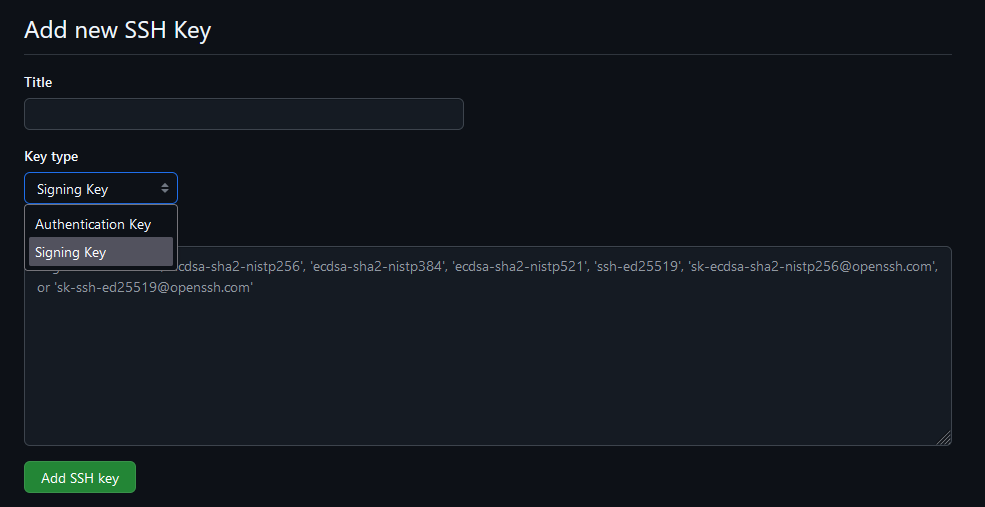
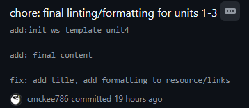

<div class="flex-container">
        </img>
    <p>
        <h1>Contributing to the ProLUG Linux Sysadmin Course Book</h1>
    </p>
</div>

The Professional Linux Users Group (ProLUG) provides a set of requirements
and guidelines to contribute to this project. Below are steps to ensure
contributors are adhering to those guidelines and fostering a productive
version control environment.

## Table of Contents

- [How to be a Successful Contributor](#how-to-be-a-successful-contributor)
- [Signing your Git Commits with SSH](#signing-your-git-commits-with-ssh)
- [Syncing your Fork with the Upstream ProLUG Repo](#syncing-your-fork-with-the-upstream-prolug-repo)
- [Basic Contribution Workflow](#basic-contribution-workflow)
  - [Comment First](#comment-first)
  - [Create a Fork](#create-a-fork)
  - [Clone the Fork to your Local Machine](#clone-the-fork-to-your-local-machine)
  - [Create a New Branch](#create-a-new-branch)
  - [Understand a few Best Practices](#understand-a-few-best-practices)
  - [Commit and Push your Changes](#commit-and-push-your-changes)
  - [Comment your Changes](#comment-your-changes)
  - [Create a Pull Request](#create-a-pull-request)
- [Supporting Material](#supporting-material)

## How to be a Successful Contributor

---

To be an effective contributor understanding [Git](https://git-scm.com/), whether
through the command line or an external tool, will be an important part of contributing.
To this effect it is important that any individual who contributes to this project have
a working understanding of committing, merging, and other fundamental Git workflows.

For clarity this project utilizes GitHub for remote repositories and CI/CD testing
pipeline workflows. Git and GitHub are two separate entities where GitHub provides
the hosting services and Git provides the version control.

Prospective contributors are directed to several resources should they feel their
competency with Git or GitHub falls short:

Git documentation:

- <https://git-scm.com/doc>

Git and GitHub video tutorials:

- [ByteByteGo's Git Explained in 4 Minutes (4m)](https://www.youtube.com/watch?v=e9lnsKot_SQ)
- [Fireship's How to use Git and Github (12m)](https://youtu.be/HkdAHXoRtos)
- [freeCodeCamp's Git and GitHub Crash Course (1hr)](https://youtu.be/RGOj5yH7evk)

## Signing your Git Commits with SSH

---

Contributors who elect to contribute through the command line will need
to verify their identities before their commits can be accepted. **This step
is not required if contributors will be submitting changes via GitHub.com itself**
since users will have verified their identities with GitHub's own verification
process.

**To reiterate, individuals contributing via command line will need to sign their
commits through SSH**. Signing GitHub commits helps ProLUG validate incoming commits
from trusted contributors that reside outside the GitHub ecosystem. It can be quite
trivial to impersonate users on GitHub and it is in the best interest of the project
and contributors to observe this security practice.

It should also be noted that GitHub supplies tools like [GitHub CLI](https://cli.github.com/)
that abstract away the process of signing and verifying commits from the command line.
GitHub provides a `gh auth login` function to facilitate the procedure which contributors
can employ without the necessary changes suggested below.

To Sign your Git Commits with SSH:

Generate an SSH key pair if you don't have one:

```bash
ssh-keygen -t ed25519
```

Add SSH public key ('.pub' suffix) to GitHub as "Signing Key".
</img>

\* GitHub.com -> Profile -> Settings -> GPG and SSH Keys -> Add SSH Key -> Drop down -> Signing Key

Below is a bash script that will attempt to configure signing
Git commits on a localhost:

```bash
#!/bin/bash
GH_USERNAME="YourUsername"
git config --global gpg.format ssh
git config --global user.signingkey ~/.ssh/id_ed25519.pub
git config --global tag.gpgSign true
git config --global commit.gpgSign true
mkdir -p ~/.config/git
touch ~/.config/git/allowed_signers
echo "${GH_USERNAME} $(cat ~/.ssh/id_ed25519.pub)" > ~/.config/git/allowed_signers
git config --global gpg.ssh.allowedSignersFile ~/.config/git/allowed_signers
# Make a commit to verify
git log --show-signature -1
```

Make a commit after running those commands and then use `git log --show-signature -1`.
You should see something like `Good "git" signature for <yourname> with ED25519 key SHA256:abcdef...` if it worked.

</img>

Your commits should now be verified from your account. This helps us ensure that valid users are
contributing to this project. Unverified commits will be scrutinized and likely discarded.

## Syncing your Fork with the Upstream ProLUG Repo

---

</img>

In an effort to minimize merge conflicts we strongly suggest forks remain up to date with
the original repository before committing changes. This will help us reduce pull request management overhead.

<div class = warning>
Pull requests with substantial merge conflicts may be rejected.
</div>

You can do this from the GitHub web UI easily with the `Sync Fork` button. If you want to do this from the terminal, you can add a new `git remote` called `upstream`.

```bash
git remote add upstream https://github.com/ProfessionalLinuxUsersGroup/psc.git
```

Then, to sync your local fork with the original repo, do a `git pull` from the `upstream` remote.

```bash
git pull upstream main
```

This fork should now be up to date with the original upstream repository.

## Basic Contribution Workflow

---

You'll create your own fork of the repository using the GitHub web UI, create a
branch, make changes, push to your fork, then open a pull request.

### Comment First

If you'd like to work on a specific worksheet or lab, please let us know first by
commenting on the issue so you can be assigned to it.
This way, other contributors can see that someone is already working on it.

This helps the repository maintainers and contributors attain a high degree of
visibility and collaboration before merging changes.

### Create a Fork

Go to the [original repository link](https://github.com/ProfessionalLinuxUsersGroup/psc).
Click on "Fork" on the top right.
Now you'll have your own version of the repository that you can clone.

```bash
git clone git@github.com:YOUR_USERNAME/psc.git
# Or, with https:
git clone https://github.com/YOUR_USERNAME/psc.git
```

### Clone the Fork to your Local Machine

Then you'll need to clone your fork down to your local machine in order to work on it.

```bash
git clone git@github.com:yourname/psc.git
```

### Create a New Branch

Whenever making changes contributors are highly encouraged to create a branch with an
appropriate name. Switch to that branch, then make changes there.

For example, if you're working on the Unit 1 Worksheet:

```bash
git branch unit1-worksheet
git switch unit1-worksheet
# Or, simply:
git switch -c unit1-worksheet
```

Make changes to the `u1ws.md`.

## Understand a few Best Practices

---

### Git Rebasing

<div class="warning">
  <strong>FIRST AND FOREMOST, ONLY REBASE IN LOCAL REPOSITORIES, NEVER REBASE
  A PUBLIC BRANCH OR REPOSITORY UNLESS YOU FULLY UNDERSTAND THE CONSEQUENCES.
  YOU HAVE BEEN WARNED.</strong>
</div>

Proper implementation of rebasing can leave a clean, and easily readable
commit history for all concerned parties. The Git documentation provides a
succinct explanation of its utility and how it **could potentially ruin a project**.

Rebasing also plays a role in facilitating any commit reverts that may need
to be made in the future. More on that will follow.

<div class="warning">
  <strong>USE REBASING WISELY</strong>
</div>

Git Rebasing documentation: <https://git-scm.com/book/en/v2/Git-Branching-Rebasing>

### Commit Early, Often, and Squashing Commits

It is great practice to commit early, and often. This however can produce hard
to read commits for repo maintainers and contributors. Squashing commits, which is
a type of rebasing, can be utilized to compress a large number of commits made in
a local repository before being pushed into a remote repository and eventual
pull requests.

Below is an example of 4 local commits squashed into a single commit that was pushed
remotely:

</img>

Squashing commits can improve readability, but its primary utility,
especially for larger projects, may be in addressing an event where
rolling back several commits due to a bug or test can be done with a single
commit revert.

freeCodeCamp has a [great write-up on this procedure](https://www.freecodecamp.org/news/git-squash-commits/).
When done appropriately this can greatly facilitate the development process.
Contributors are strongly encouraged to begin exploring these types of workflows
if they never have.

<div class="warning">
<strong>AGAIN, USE REBASING AND SQUASHING WISELY</strong>
</div>

### Git Stashing

Another useful practice is to employ "stashing" uncommitted files in
a local repository. This is useful in many contexts including stashing
local changes to resolve recently introduced remote vs. local repo conflicts,
or quickly switching working spaces.

Stashing effectively unstages any changes made in the local repo and
saves them to be applied later. This can further help facilitate a rebase
or merge before committing changes upstream for instance.

More on this here:

<https://www.atlassian.com/git/tutorials/saving-changes/git-stash>

<https://git-scm.com/book/en/v2/Git-Tools-Stashing-and-Cleaning>

## Commit and Push your Changes

---

First make sure your forked repo is [up-to-date with the original](#syncing-your-fork-with-the-upstream-prolug-repo).
Create your commit (make sure it's [signed](#signing-your-git-commits-with-ssh)!), then push changes to **your own fork** on the new branch.

```bash
git commit -m "descriptive commit message"
git push origin unit1-worksheet
```

### Comment your Changes

Before creating a pull request, make a comment on the issue containing your changes.
We're doing this since the GitHub organization feature is paid and we are doing this
for free, so there is only one person who is able to merge pull requests at the moment.

### Create a Pull Request

Now you'll be able to go to the [original repository link](https://github.com/ProfessionalLinuxUsersGroup/psc) and go to the "Pull Requests" tab and create a new pull request.
Select your branch `unit1-worksheet`, and create a description and mention an issue by number (e.g., `#5`).

## Supporting Material

---

Below are links to the necessary materials to build out the course templates:

- Look over the [template pages wiki](https://github.com/ProfessionalLinuxUsersGroup/psc/wiki), or directly here:
  - Pages: [intro](https://github.com/ProfessionalLinuxUsersGroup/psc/blob/main/ref/intro.md),
    [bonus](https://github.com/ProfessionalLinuxUsersGroup/psc/blob/main/ref/ub.md),
    [lab](https://github.com/ProfessionalLinuxUsersGroup/psc/blob/main/ref/ulab.md),
    [worksheet](https://github.com/ProfessionalLinuxUsersGroup/psc/blob/main/ref/uws.md)

Ancillary unit videos provided by Scott:

- <https://www.youtube.com/watch?v=eHB8WKWz2eQ&list=PLyuZ_vuAWmprPIqsG11yoUG49Z5dE5TDu>

PDF and docs directly related to each Unit of the course:

- <https://discord.com/channels/611027490848374811/1098309490681598072>
