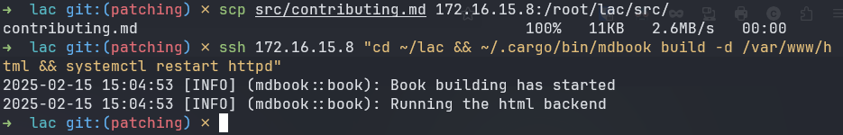

<div class="flex-container">
        </img>
    <p>
        <h1>Contributing and Local Development</h1>
    </p>
</div>

It is strongly encouraged that contributors test their changes before making
commits. To help facilitate this process a set of instructions and guidelines
are provided below. These guidelines are by no means a requirement or the only
set of procedures to locally develop on this project.

The examples, code, and commands provided below were developed using such
technologies as Ansible, containers, bash scripts, and more.

## Build Dependencies

---

The ProLUG Security Course (PSC) utilizes [mdBook](https://github.com/rust-lang/mdBook)
(markdown Book), a friendly and popular markdown utility that quickly exports
files and web structures for documentation or general website use cases.

Utilizing mdBook this course then deploys the exported web structure to a
[Git Pages workflow](https://docs.github.com/en/pages/getting-started-with-github-pages/using-custom-workflows-with-github-pages) and runner that then produces an easily navigable website.

Below is the current workflow that deploys the Git Page for the course:

<div style="text-align: center;">

</img>

</div>

To achieve this workflow locally the following environment and dependencies are
required:

<dl>
    <dt>1. A localhost, this could be a container, virtual machine, or local machine</dt>
    <dt>2. The following packages installed on such machine:</dt>
    <dd>- httpd or apache</dd>
    <dd>- git</dd>
    <dd>- gcc</dd>
    <dd>- rust</dd>
    <dd>- cargo</dd>
    <dt>3. And a clone of a ProLUG repository</dt>
</dl>

## Building, Deploying, and Developing Locally

---

Below is a set of scripts and Ansible-Playbooks that can quickly achieve this
environment in an automated fashion. They are only designed to "standup" these
machines, they are otherwise unintelligent and will not manage or cleanup
environments if things go awry.

### Ansible-Playbook

<https://github.com/ProfessionalLinuxUsersGroup/psc/blob/main/src/assets/deploy/ansible-playbook.yml>

To use this playbook, your machine(s)/containers must be configured correctly for Ansible.
If you don't know the requirements to administer a machine via Ansible, documentation
has been provided below.

<div class = warning>
This playbook will need to be modified based on which distribution or package management
tool is configured.
</div>

Getting started with Ansible:  
<https://docs.ansible.com/ansible/latest/getting_started/index.html>

### Bash Script

Many of these commands assume a root user.

Export and execute this script to your machine/container.

<div class=warning>

Dependencies can total over ~500MB compressed and 1-2GB unpackaged or more.

Debian containers/machines will require building many of these packages from
source or adding additional repositories as Debian has a far slower package
version adoption rate for stability, thus is not recommended for deploying mdBook.

</div>

These scripts will take up to 5-7 minutes to download the necessary dependencies
and compile mdBook depending on the machine/container's capabilities.

Tested with Rocky 9 and Ubuntu 24.04 Containers.

APT frontends:

```bash
#!/bin/bash
apt-get update
apt-get -y install apache2 git gcc rustc-1.80 cargo-1.80
cargo-1.80 install --locked mdbook
systemctl enable apache2 && systemctl start apache2
cd && git clone https://github.com/ProfessionalLinuxUsersGroup/psc
echo 'PATH=$PATH:~/.cargo/bin/' | tee -a ~/.profile
export PATH=$PATH:~/.cargo/bin/ && echo $PATH
cd ~/psc && mdbook build -d /var/www/html
systemctl restart apache2
```

DNF frontends:

```bash
#!/bin/bash
dnf update
dnf install -y httpd git gcc rust cargo
cargo install --locked mdbook
systemctl enable httpd && systemctl start httpd
cd && git clone https://github.com/ProfessionalLinuxUsersGroup/psc
echo 'PATH=$PATH:~/.cargo/bin/' | tee -a ~/.bash_profile
export PATH=$PATH:~/.cargo/bin/ && echo $PATH
cd ~/psc && mdbook build -d /var/www/html
systemctl restart httpd
```

#### From here you can use such commands from your localhost to implement changes:

```bash
cd {working psc directory} #for example: /root/psc or ~/psc
mdbook build -d /var/www/html
systemctl restart {httpd or apache}
```

These commands will switch your shell into the appropriate directory, execute
the necessary cargo binaries located in its installed PATH, build the mdBook
from any files that were changed, and then finally restart the web server.

From there you should be able to see any changes you have made are reflected.

#### Or send commands over to a networked container or machine:

**Note:** To minimize complexity and given the nature of commands over SSH, these
commands will need to utilize absolute paths.

```bash
scp {working directory}/{targeted document} {TARGET_IP}:/root/psc/src/{targeted document}
ssh {TARGET_IP} "cd /root/psc && ~/.cargo/bin/mdbook build -d /var/www/html && systemctl restart httpd"
```

An example of the workflow after making changes:

```bash
scp src/development.md 172.16.15.8:/root/psc/src/
ssh 172.16.15.8 "cd /root/psc && ~/.cargo/bin/mdbook build -d /var/www/html && systemctl restart httpd"
```

</img>
