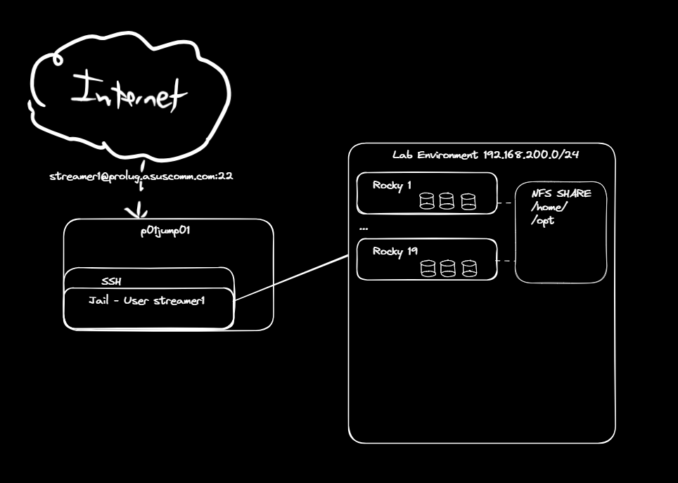

        </img>
    

        <h1>ProLUG Security Engineering Course</h1>
    

Welcome to the ProLUG Security Engineering Course Book.

## This Book

Contains all materials pertaining to the course including links to external resources.
It has been put together with care by a number of ProLUG group members referencing original
instructional materials produced by Scott Champine (Het Tanis).

The content is version controlled with Git and stored here: <https://github.com/ProfessionalLinuxUsersGroup/psc/>

Furthermore, the book has been built with mdbook for ease of navigation. Be sure to try the search functionality.

### Course Description

This course addresses how to secure Linux a corporate environment. This course will focus on adhering
to regulations, best practices, and industry standards. This course will expose the concepts of controls,
their implementation, and how they fit into overall security posture. The learner will practice securely
building, deploying, integrating, and monitoring Linux systems. Standard security documentation and
reporting will be practiced throughout, to better prepare the learner for the industry.

### Prerequisite(s) and/or Corequisite(s):

Prerequisites: None

**Credit hours: N/A**

**Contact hours: 100 (40 Theory Hours, 60 Lab Hours)**

## Course Summary

### Major Instructional Areas

- Build Standards and Compliance
- Securing the Network Connection
- User Access and System Integration
- Bastion Hosts and Air-Gaps
- Updating Systems and Patch Cycles
- Monitoring and Parsing Logs
- Monitoring and Alerting
- Configuration drift and Remediation
- Certificate and Key Madness

### Course Objectives

- Build and configure a Linux system to adhere to compliance frameworks
- Integrating Linux to a network in a secure fashion
- Integrating Linux with Enterprise Identity and Access Management (IAM) frameworks
- Implement User ingress controls to a system/network with bastion frameworks
- Updating Linux to resolve security vulnerabilities and reporting out to security teams
- Design logging workflows to move event logging off of systems for real time monitoring
- Monitoring and alerting on events in Linux
- Maintaining system configuration drift and remediation

#### Written Discussions

Are assigned as 'Discussion Posts' within each unit. Discussions generally take place
within the Discord Server under #prolug-projects. More specifically, each unit will
contain links to particular discussion posts within #prolug-projects.

#### Completing the Course

In order to complete this course students must participate in group discussions and
complete provided labs. Additionally, students are to propose and complete a final
project involving skills learned from the course.

<!-- 
 -->
<!-- <strong>Note</strong>: If any lab download does not work, check the <code>/labs</code> folder on the server for a <code>[course]_[unit#].zip</code> file to complete the activities. -->
<!-- 
 -->

#### Recommended Tools, Resources, and Frameworks

- Killercoda: <https://killercoda.com/>
- STIG Resources: <https://public.cyber.mil/stigs/srg-stig-tools/>
  - Recommended (but not required) STIG Viewer: v2.18
- NIST: <https://www.nist.gov/>
- Open Worldwide Application Security Project Top 10: <https://owasp.org/www-project-top-ten/>
- CIS Controls and Benchmarks: <https://www.cisecurity.org/cis-benchmarks>

### Required Resources

#### Option #1 (Killercoda Machine)

Cloud Lab server running Ubuntu on Killercoda.

Minimal resources can accomplish our tasks

- 1 CPU
- 2 GB Ram
- 30 GB Hard Drive
- Network Interface (IP already setup)

#### Option #2 (Home Lab)

Local VM server running: RHEL, Fedora, Rocky

Minimal resources

- 1 CPU
- 2GB RAM
- Network Interface (Bridged)

#### Option #3 (ProLUG Remote Lab)

ProLUG Lab access to Rocky 9.4+ instance.

Minimal resources can accomplish our tasks

- 1 CPU
- 4 GB RAM
- Network Interface (IP already setup)

</img>

### Course Plan

#### Instructional Methods

This course is designed to promote learner-centered activities and support the development of Linux
security skills. The course utilizes individual and group learning activities, performance-driven
assignments, problem-based cases, projects, and discussions. These methods focus on building
engaging learning experiences conducive to development of critical knowledge and skills that can be
effectively applied in professional contexts.

#### Class Size

This class will effectively engage 40-60 learners.

#### Class Schedule

<https://discord.com/events/611027490848374811/1353330418669326407>

Class will meet over weekend (Brown bag) sessions. 1 time per week, for 10 weeks. There will be a total
of 10 sessions.

| Session |                    Topic                     |
| :-----: | :------------------------------------------: |
|    1    |   Unit 1 - Build Standards and Compliance    |
|    2    |   Unit 2 - Securing the network connection   |
|    3    | Unit 3 - User Access and system integration  |
|    4    |      Unit 4 - Bastion hosts and airgaps      |
|    5    |  Unit 5 - Updating systems and patch cycles  |
|    6    |     Unit 6 - Monitoring and parsing logs     |
|    7    |       Unit 7 - Monitoring and alerting       |
|    8    | Unit 8 - Configuration drift and remediation |
|    9    |     Unit 9 - Certificate and key madness     |
|   10    |      Unit 10 - Recap and final project       |

### Suggested Learning Approach

In this course, you will be studying individually and within a group of your peers,
primarily in a lab environment. As you work on the course deliverables, you are
encouraged to share ideas with your peers and instructor, work collaboratively on
projects and team assignments, raise questions, and provide constructive feedback.
