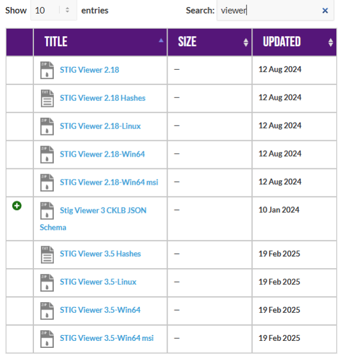
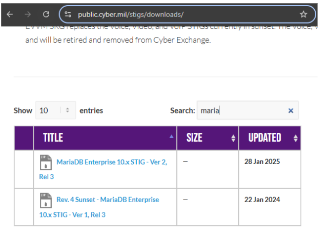

<div class="flex-container">
        </img>
    <p>
        <h1>Unit 1 Lab - Build Standards and Compliance</h1>
    </p>
</div>

### Required Materials

Putty or other connection tool Lab Server

Root or sudo command access

STIG Viewer 2.18 (download from <https://public.cyber.mil/stigs/downloads/> )

#### Downloads

The lab has been provided below. The document(s) can be transposed to
the desired format so long as the content is preserved. For example, the `.txt`
could be transposed to a `.md` file.

- <a href="./assets/downloads/u1/u1_lab.txt" target="_blank" download>📥 u1_lab(`.txt`)</a>
- <a href="./assets/downloads/u1/u1_lab.docx" target="_blank" download>📥 u1_lab(`.docx`)</a>

## Module 1: Exploring System Information

### Exercise 1.1: Familiarizing ourselves with the System

```bash
mount | grep -i noexec

mount | grep -i nodev

mount | grep -i nosuid

# Approximately how many of your mounted filesystems have each of these values?
```

### Exercise 1.2: Checking Mounted Systems

```bash
sysctl -a | grep -i ipv4

sysctl -a | grep -i ipv6

# How many of each are there?
```

```bash
sysctl -a | grep -i ipv4 | grep -i forward

# Does IPv4 forward on interfaces?
```

```bash
lsmod | grep -i tables

# What type of tables exist?
```

## Module 2: PreLAB

1. Download the STIG Viewer 2.18 from - <https://public.cyber.mil/stigs/downloads/>
   

2. Download the STIG for Mariadb and the import it into your STIG viewer.
   

## Module 3: Lab

This lab is designed to have the engineer practice securing a Linux server or service
against a set of configuration standards.
These standards are sometimes called benchmarks, checklists, or guidelines.  
The engineer will be using STIG Viewer 2.18 to complete this lab.

### MariaDB Service configuration:

1. Connect to a hammer server.
2. Install MariaDB.

```bash
dnf install mariadb-server

# Ensure that it is running

systemctl start mariadb

systemctl status mariadb

ss -ntulp | grep 3306
```

- Check and remediate v-253666 STIG.
  

  - What is the problem?
  - What is the fix?
  - What type of control is being implemented?
  - Is it set properly on your system?

  Connect to MariaDB locally.

  ```bash
  mysql
  ```

  Run the SQL command in the STIG's Fix Text section:

  ```sql
  SELECT user, max_user_connections FROM mysql.user;
  ```

  

  Can you remediate this finding?
  

- Check and remediate `v-253677 STIG`
  - What is the problem?
  - What is the fix?
  - What type of control is being implemented?
  - Is it set properly on your system?
- Check and remediate `v-253678 STIG`
  - What is the problem?
  - What is the fix?
  - What type of control is being implemented?
  - Is it set properly on your system?
- Check and remediate `v-253734 STIG`
  - What is the problem?
  - What is the fix?
  - What type of control is being implemented?
  - Is it set properly on your system?
