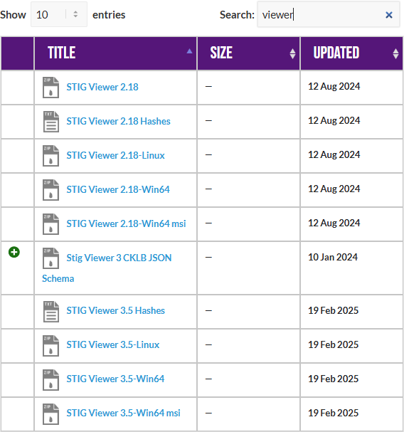
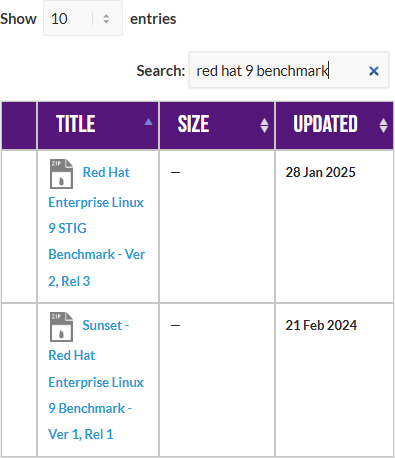
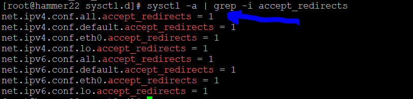
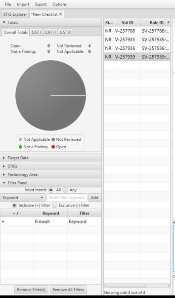

<div class="flex-container">
        </img>
    <p>
        <h1>Unit 2 Lab - Network Standards and Compliance</h1>
    </p>
</div>

### Required Materials

Putty or other connection tool Lab Server

Root or sudo command access

STIG Viewer 2.18 (download from https://public.cyber.mil/stigs/downloads/ )

To qualify for the ProLUG certification download, fill out, and save the lab worksheet:

- <a href="./assets/downloads/u2/u2_lab.docx" target="_blank" download>📥 u2_lab(`.docx`)</a>

## Pre-Lab Warm-Up

---

**EXERCISES** (Warmup to quickly run through your system and familiarize yourself)

```bash
sysctl -a | grep -i ipv4 | grep -i forward
# Does this system appear to be set to forward? Why or why not?

sysctl -a | grep -i ipv4 | grep -i martian
# What are martians and is this system allowing them?

sysctl -a | grep -i panic
# How does this system handle panics?

sysctl -a | grep -i crypto
# What are the settings you see? Is FIPS enabled?

cat /proc/cmdline
fips-mode-setup --check
sestatus
cat /etc/selinux/config
```

What information about the security posture of the system can you see here?  
Can you verify SELINUX status?  
Can you verify FIPS status?

Download the STIG Viewer 2.18 from - <https://public.cyber.mil/stigs/downloads/>

</img>

Download the STIG for RHEL 9 and the import it into your STIG viewer

</img>

Create a checklist from the opened STIG for RHEL 9

</img>

## Lab 🧪

---

This lab is designed to have the engineer practice securing a Linux server or service against a set of configuration standards. These standards are sometimes called benchmarks, checklists, or guidelines. The engineer will be using STIG Viewer 2.18 to complete this lab.

### Network Service configuration

Connect to a hammer server  
Filter by ipv4 and see how many STIGs you have.

</img>

#### Examine STIG V-257957

What is the problem?  
What is the fix?  
What type of control is being implemented?  
Is it set properly on your system?

```bash
sysctl -a | grep -i ipv4 | grep -i syncookies
```

</img>

Can you remediate this finding?  
In this case it’s already correctly set.  
But if we needed to, we would set that value in /etc/sysctl.d/00- remediate.conf  
And then reload sysctl with `sysctl --system`

#### Check and remediate V-257958 STIG

What is the problem?  
What is the fix?  
What type of control is being implemented?  
Is it set properly on your system?

</img>

How would you go about remediating this on your system?

#### Check and remediate V-257960 and V-257961 STIGs

What is the problem? How are they related?  
What is the fix?  
What type of control is being implemented?  
Is it set properly on your system?

#### Filter by firewall

How many STIGS do you see?

</img>

What do these STIGS appear to be trying to do? What types of controls are they?

### Firewall port exposure

Scenario:

<blockquote>

Your team needs to use node_exporter with Prometheus to allow scraping of system information
back to your network monitoring solution. You are running a firewall, so you need to expose
the port that node_exporter runs on to the network outside of your system.

</blockquote>

#### Expose a network port through your firewall

```bash
# Verify that your firewall is running
systemctl status firewalld

# Verify that your firewall has the service defined
firewall-cmd –get-services | grep -i node
ls /usr/lib/firewalld/services | grep -i node

# Verify that the service is not currently enabled for node_exporter
fireall-cmd –list-services

# Examine the structure of the firewall .xml file
cat /usr/lib/firewalld/services/prometheus-node-exporter.xml

# Enable the service through your firewall
firewall-cmd --permanent --add-service=prometheus-node-exporter firewall-cmd –reload

# Verify that the service is currently enabled for node_exporter
firewall-cmd --list-services
```

### Automate STIG remediation on a system

There are many options and the STIG remediation steps are well known. Here the learner
will examine a few ways to generate Ansible and Shell fixes to your system. Then one can
apply all of them, or just some of them. This is the real value of a security engineer
focused Linux engineer, the trade-off between security and productivity.

#### Download and extract a STIG remediation tool

```bash
cd /root mkdir stigs cd stigs
wget -O U_RHEL_9_V2R3_STIG_Ansible.zip https://dl.dod.cyber.mil/wp- content/uploads/stigs/zip/U_RHEL_9_V2R3_STIG_Ansible.zip
unzip U_RHEL_9_V2R3_STIG_Ansible.zip mkdir ansible
cp rhel9STIG-ansible.zip ansible/ cd ansible
unzip rhel9STIG-ansible.zip
```

#### Examine the default values for STIGS

```bash
cd /root/stigs/ansible/roles/rhel9STIG/defaults/
vim main.yml
```

Search for a few of the STIG numbers you used earlier and see their default values.

- use /257784 to search

#### Examine the playbook to see how those are applied in a running system.

```bash
vim /root/stigs/ansible/roles/rhel9STIG/tasks/main.yml
```

- use /257784 to search for the STIG from above and see how it is fixed in the playbook.

#### Create an Ansible playbook from OpenSCAP

```bash
dnf -y install openscap-scanner openscap-utils openscap-scanner scap-security-guide

# Generate the Ansible
oscap xccdf generate fix --profile ospp --fix-type ansible
/usr/share/xml/scap/ssg/content/ssg-rhel9-ds.xml > draft-disa- remediate.yml

# Examine the file
vim draft-disa-remediate.yml

# Generate a BASH version
oscap xccdf generate fix --profile ospp --fix-type bash
/usr/share/xml/scap/ssg/content/ssg-rhel9-ds.xml > draft-disa- remediate.sh

# Examine the file
vim draf-disa-remediate.sh
```
