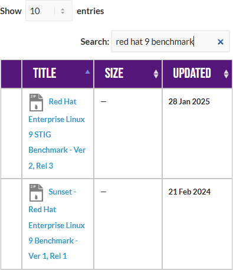
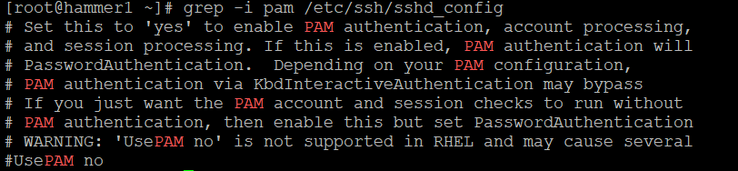

<div class="flex-container">
        </img>
    <p>
        <h1>Unit 3 Lab - User Access and System Integration</h1>
    </p>
</div>

### Required Materials

Putty or other connection tool Lab Server  
Root or sudo command access

STIG Viewer 2.18 (download from https://public.cyber.mil/stigs/downloads/ )
Download the STIG for RHEL 9 and the import it into your STIG viewer
Create a checklist from the opened STIG for RHEL 9

#### Downloads

The lab has been provided below. The document(s) can be transposed to
the desired format so long as the content is preserved. For example, the `.docx`
could be transposed to a `.md` file.

- <a href="./assets/downloads/u3/u3_lab.pdf" target="_blank" download>📥 u3_lab(`.pdf`)</a>
- <a href="./assets/downloads/u3/u3_lab.docx" target="_blank" download>📥 u3_lab(`.docx`)</a>

**EXERCISES** (Warmup to quickly run through your system and familiarize yourself)

```bash
ls -l /etc/pam.d/
# What are the permissions and names of files? Can everyone read them?

cat /etc/pam.d/sshd

# What information do you see in this file?
# Does any of it look familiar to you?
```

## Pre-Lab Warm-Up

---

Download the STIG Viewer 2.18 from - https://public.cyber.mil/stigs/downloads/

</img>

Download the STIG for RHEL 9 and the import it into your STIG viewer

</img>

Create a checklist from the opened STIG for RHEL 9

</img>

## Lab 🧪

---

This lab is designed to have the engineer practice securing a Linux server or service against a set of configuration standards. These standards are sometimes called benchmarks, checklists, or guidelines. The engineer will be using STIG Viewer 2.18 to complete this lab.

### PAM configuration

Connect to a hammer server  
Filter by pam and see how many STIGS you have. (Why is it really only 16?)

</img>

#### Examine STIG V-257986

What is the problem?  
What is the fix?  
What type of control is being implemented?  
Is it set properly on your system?

```bash
grep -i pam /etc/ssh/sshd_config
```

</img>

Can you remediate this finding?

#### Check and remediate STIG V-258055

What is the problem?  
What is the fix?  
What type of control is being implemented?  
Are there any major implications to think about with this change on your system? Why or why not?  
Is it set properly on your system?  
How would you go about remediating this on your system?

#### Check and remediate STIG V-258098

What is the problem?  
What is the fix?  
What type of control is being implemented?  
Is it set properly on your system?

#### Filter by “password complexity”

</img>

How many are there?  
What are the password complexity rules?  
Are there any you haven’t seen before?

#### Filter by sssd

How many STIGS do you see?  
What do these STIGS appear to be trying to do? What types of controls are they?

### OpenLDAP Setup

You will likely not build an LDAP server in a real world environment. We are doing it for understanding and ability to complete the lab. In a normal corporate environment this is likely Active Directory.

To simplify some of the typing in this lab, there is a file located at
`/lab_work/identity_and_access_management.tar.gz` that you can pull down to your system with the correct `.ldif` files.

#### Install and configure OpenLDAP

#### Stop the warewulf client

```bash
systemctl stop wwclient
```

#### Edit your /etc/hosts file

use your server line

Entry for hammer1 for example:  
`192.168.200.151 hammer1 hammer1-default ldap.prolug.lan ldap`

#### Setup dnf repo

```bash
dnf config-manager --set-enabled plus
dnf repolist
dnf -y install openldap-servers openldap-clients openldap
```

#### Start slapd systemctl

```bash
systemctl start slapd
ss -ntulp | grep slapd
```

#### Allow ldap through the firewall

```bash
firewall-cmd --add-service={ldap,ldaps} --permanent
firewall-cmd --reload
firewall-cmd --list-all
```

#### Generate a password (use `testpassword`)

[root@hammer1 ~]# `slappasswd`

Output:

<blockquote>

New password:  
Re-enter new password:  
{SSHA}wpRvODvIC/EPYf2GqHUlQMDdsFIW5yig

</blockquote>

#### Change the password

[root@hammer1 ~]# `vi changerootpass.ldif`

```yaml
dn: olcDatabase={0}config,cn=config
changetype: modify
replace: olcRootPW
olcRootPW: {SSHA}vKobSZO1HDGxp2OElzli/xfAzY4jSDMZ
```

[root@hammer1 ~]# `ldapadd -Y EXTERNAL -H ldapi:/// -f changerootpass.ldif `

```yaml
SASL/EXTERNAL authentication started
SASL username: gidNumber=0+uidNumber=0,cn=peercred,cn=external,cn=auth
SASL SSF: 0
modifying entry "olcDatabase={0}config,cn=config"
```

#### Generate basic schemas

```bash
ldapadd -Y EXTERNAL -H ldapi:/// -f /etc/openldap/schema/cosine.ldif
ldapadd -Y EXTERNAL -H ldapi:/// -f /etc/openldap/schema/nis.ldif
ldapadd -Y EXTERNAL -H ldapi:/// -f /etc/openldap/schema/inetorgperson.ldif
```

#### Set up the domain (USE THE PASSWORD YOU GENERATED EARLIER)

[root@hammer1 ~]# `vi setdomain.ldif`

```yaml
dn: olcDatabase={1}monitor,cn=config
changetype: modify
replace: olcAccess
olcAccess: {0}to * by dn.base="gidNumber=0+uidNumber=0,cn=peercred,cn=external,cn=auth"
read by dn.base="cn=Manager,dc=prolug,dc=lan" read by * none

dn: olcDatabase={2}mdb,cn=config
changetype: modify
replace: olcSuffix
olcSuffix: dc=prolug,dc=lan

dn: olcDatabase={2}mdb,cn=config
changetype: modify
replace: olcRootDN
olcRootDN: cn=Manager,dc=prolug,dc=lan

dn: olcDatabase={2}mdb,cn=config
changetype: modify
add: olcRootPW
olcRootPW: {SSHA}s4x6uAxcAPZN/4e3pGnU7UEIiADY0/Ob

dn: olcDatabase={2}mdb,cn=config
changetype: modify
add: olcAccess
olcAccess: {0}to attrs=userPassword,shadowLastChange by
dn="cn=Manager,dc=prolug,dc=lan" write by anonymous auth by self write by * none
olcAccess: {1}to dn.base="" by * read
olcAccess: {2}to * by dn="cn=Manager,dc=prolug,dc=lan" write by * read
```

#### Run it

[root@hammer1 ~]# `ldapmodify -Y EXTERNAL -H ldapi:/// -f setdomain.ldif`

Output:

<blockquote>

SASL/EXTERNAL authentication started  
SASL username: gidNumber=0+uidNumber=0,cn=peercred,cn=external,cn=auth  
SASL SSF: 0  
modifying entry "olcDatabase={1}monitor,cn=config"  
modifying entry "olcDatabase={2}mdb,cn=config"  
modifying entry "olcDatabase={2}mdb,cn=config"  
modifying entry "olcDatabase={2}mdb,cn=config"  
modifying entry "olcDatabase={2}mdb,cn=config"

</blockquote>

#### Search and verify the domain is working.

[root@hammer1 ~]# `ldapsearch -H ldap:// -x -s base -b "" -LLL "namingContexts"`

Output:

<blockquote>

dn:  
namingContexts: dc=prolug,dc=lan

</blockquote>

#### Add the base group and organization.

[root@hammer1 ~]# `vi addou.ldif`

```yaml
dn: dc=prolug,dc=lan
objectClass: top
objectClass: dcObject
objectclass: organization
o: My prolug Organisation
dc: prolug

dn: cn=Manager,dc=prolug,dc=lan
objectClass: organizationalRole
cn: Manager
description: OpenLDAP Manager

dn: ou=People,dc=prolug,dc=lan
objectClass: organizationalUnit
ou: People

dn: ou=Group,dc=prolug,dc=lan
objectClass: organizationalUnit
ou: Group
```

`ldapadd -x -D cn=Manager,dc=prolug,dc=lan -W -f addou.ldif`

#### Verifying

`ldapsearch -H ldap:// -x -s base -b "" -LLL "+"`  
`ldapsearch -x -b "dc=prolug,dc=lan" ou`

#### Add a user

Generate a password  
`slappasswd` (use testuser1234)

[root@hammer1 ~]# `vi adduser.ldif`

```yaml
dn: uid=testuser,ou=People,dc=prolug,dc=lan
objectClass: inetOrgPerson
objectClass: posixAccount
objectClass: shadowAccount
cn: testuser
sn: temp
userPassword: {SSHA}yb6e0ICSdlZaMef3zizvysEzXRGozQOK
loginShell: /bin/bash
uidNumber: 15000
gidNumber: 15000
homeDirectory: /home/testuser
shadowLastChange: 0
shadowMax: 0
shadowWarning: 0

dn: cn=testuser,ou=Group,dc=prolug,dc=lan
objectClass: posixGroup
cn: testuser
gidNumber: 15000
memberUid: testuser
```

`ldapadd -x -D cn=Manager,dc=prolug,dc=lan -W -f adduser.ldif`

#### Verify that your user is in the system.

`ldapsearch -x -b "ou=People,dc=prolug,dc=lan"`

#### Secure the system with TLS (accept all defaults)

```bash
openssl req -x509 -nodes -days 365 -newkey rsa:2048 -keyout /etc/pki/tls/ldapserver.key -out /etc/pki/tls/ldapserver.crt
chown ldap:ldap /etc/pki/tls/{ldapserver.crt,ldapserver.key}
```

[root@hammer1 ~]# `ls -l /etc/pki/tls/ldap*`

Output:

<blockquote>

-rw-r--r--. 1 ldap ldap 1224 Apr 12 18:23 /etc/pki/tls/ldapserver.crt  
-rw-------. 1 ldap ldap 1704 Apr 12 18:22 /etc/pki/tls/ldapserver.key

</blockquote>

[root@hammer1 ~]# `vi tls.ldif`

```yaml
dn: cn=config
changetype: modify
add: olcTLSCACertificateFile
olcTLSCACertificateFile: /etc/pki/tls/ldapserver.crt

add: olcTLSCertificateKeyFile
olcTLSCertificateKeyFile: /etc/pki/tls/ldapserver.key

add: olcTLSCertificateFile
olcTLSCertificateFile: /etc/pki/tls/ldapserver.crt
```

[root@hammer1 ~]# `ldapadd -Y EXTERNAL -H ldapi:/// -f tls.ldif`

#### Fix the /etc/openldap/ldap.conf to allow for certs

[root@hammer1 ~]# `vi /etc/openldap/ldap.conf`

```bash
#
# LDAP Defaults
#

# See ldap.conf(5) for details
# This file should be world readable but not world writable.

#BASE dc=example,dc=com
#URI ldap://ldap.example.com ldap://ldap-master.example.com:666

#SIZELIMIT 12
#TIMELIMIT 15
#DEREF never

# When no CA certificates are specified the Shared System Certificates
# are in use. In order to have these available along with the ones specified # by TLS_CACERTDIR one has to include them explicitly:

TLS_CACERT /etc/pki/tls/ldapserver.crt
TLS_REQCERT never

# System-wide Crypto Policies provide up to date cipher suite which should
# be used unless one needs a finer grinded selection of ciphers. Hence, the
# PROFILE=SYSTEM value represents the default behavior which is in place
# when no explicit setting is used. (see openssl-ciphers(1) for more info)
#TLS_CIPHER_SUITE PROFILE=SYSTEM

# Turning this off breaks GSSAPI used with krb5 when rdns = false
SASL_NOCANON on
```

`systemctl restart slapd`

### SSSD Configuration and Realmd join to LDAP

SSSD can connect a server to a trusted LDAP system and authenticate users for access to
local resources. You will likely do this during your career and it is a valuable skill to work with.

#### Install sssd, configure, and validate that the user is seen by the system

```bash
dnf install openldap-clients sssd sssd-ldap oddjob-mkhomedir authselect
authselect select sssd with-mkhomedir --force
systemctl enable --now oddjobd.service
systemctl status oddjobd.service
```

#### Uncomment and fix the lines in /etc/openldap/ldap.conf

[root@hammer1 ~]# `vi /etc/openldap/ldap.conf`

Output:

<blockquote>

BASE dc=prolug,dc=lan  
URI ldap://ldap.ldap.lan/

</blockquote>

#### Edit the sssd.conf file

[root@hammer1 ~]# `vi /etc/sssd/sssd.conf`

```yaml
[domain/default]
id_provider = ldap
autofs_provider = ldap
auth_provider = ldap
chpass_provider = ldap
ldap_uri = ldap://ldap.prolug.lan/
ldap_search_base = dc=prolug,dc=lan
#ldap_id_use_start_tls = True
#ldap_tls_cacertdir = /etc/openldap/certs
cache_credentials = True
#ldap_tls_reqcert = allow

[sssd]
services = nss, pam, autofs
domains = default

[nss]
homedir_substring = /home
```

```bash
chmod 0600 /etc/sssd/sssd.conf
systemctl start sssd
systemctl status sssd
```

#### Validate that the user can be seen

`id testuser`

Output:

<blockquote>

uid=15000(testuser) gid=15000 groups=15000

</blockquote>
