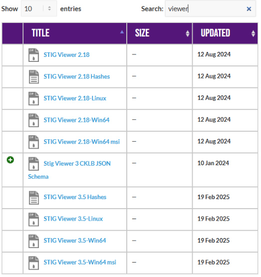
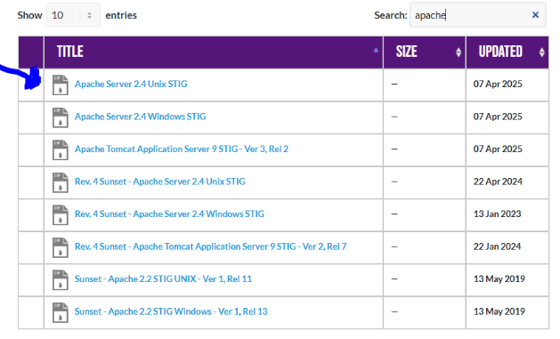
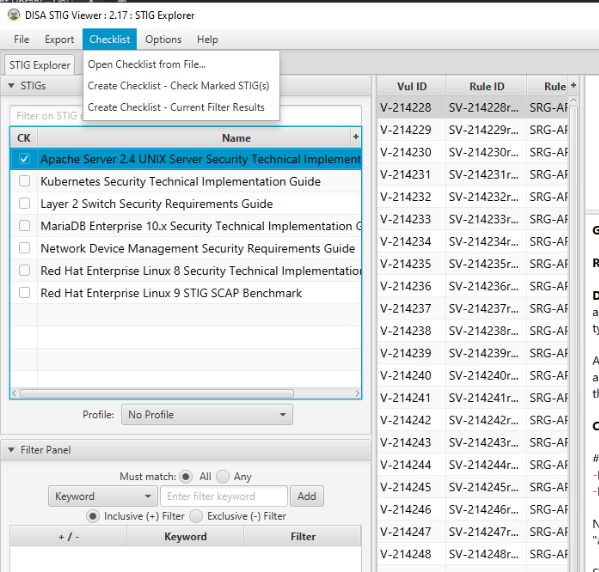
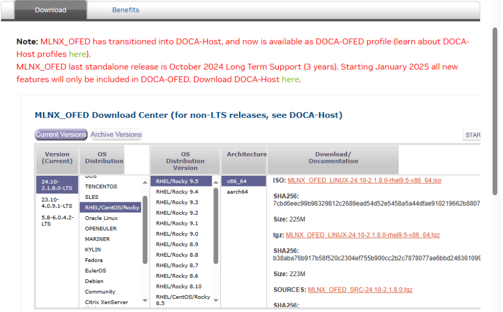

<div class="flex-container">
        </img>
    <p>
        <h1>Unit 5 Lab - Repos and Patching</h1>
    </p>
</div>

> If you are unable to finish the lab in the ProLUG lab environment we ask you `reboot`
> the machine from the command line so that other students will have the intended environment.

### Required Materials

Putty or other connection tool Lab Server

Root or sudo command access

STIG Viewer 2.18 (download from <https://public.cyber.mil/stigs/downloads/> )

#### Downloads

The lab has been provided below. The document(s) can be transposed to
the desired format so long as the content is preserved. For example, the `.txt`
could be transposed to a `.md` file.

- <a href="./assets/downloads/u5/u5_lab.txt" target="_blank" download>📥 u5_lab(`.txt`)</a>
- <a href="./assets/downloads/u5/u5_lab.pdf" target="_blank" download>📥 u5_lab(`.pdf`)</a>
<!-- - <a href="./assets/downloads/u5/u5_lab.docx" target="_blank" download>📥 u5_lab(`.docx`)</a> -->

## PreLAB

Download the STIG Viewer 2.18 from - <https://public.cyber.mil/stigs/downloads/>



Download the STIG for Apache 2.4 and the import it into your STIG viewer



Create a checklist from the opened STIG for Apache 2.4



Review the software download process for Mellanox drivers:  
[Linux InfiniBand Drivers](https://network.nvidia.com/products/infiniband-drivers/linux/mlnx_ofed/)



Look through the available downloads and see if you can find the currently available
LTS for Rocky 9.5 x86_64.  
After that find a distribution of your choice and play with their tool.

<div class="warning">
You do not have to download or move this into our environment, I have already provided them in our lab.
</div>

## LAB

This lab is designed to have the engineer practice deploying patches in a Linux environment. The
engineer will create repos and then deploy patches through an automated enterprise level Ansible
playbook. But first, the engineer will review some of the Apache 2.4 STIG requirements if they want to
run their own repo on their network.

### Apache STIGs Review

---

1. Look at the 4 STIGs for "tls"

   - What file is fixed for all of them to be remediated?

2. Install httpd on your Hammer server

   ```bash
   systemctl stop wwclient
   dnf install -y httpd
   systemctl start httpd
   ```

3. Check STIG V-214234

   - What is the problem?

   - What is the fix?

   - What type of control is being implemented?

   - Is it set properly on your system?

4. Check STIG V-214248

   - What is the problem?

   - What is the fix?

   - What type of control is being implemented?

   - Is it set properly on your system?

   - How do you think SELINUX will help implement this control in an enforcing state? Or
     will it not affect it?

### Building repos

1. Start out by removing all your active repos

   ```bash
   cd /etc/yum.repos.d
   mkdir old_archive
   mv *.repo old_archive
   dnf repolist
   ```

2. Mount the local repository and make a local repo

   ```bash
   mount -o loop /lab_work/repos_and_patching/Rocky-9.5-x86_64-dvd.iso /mnt
   df -h  # Should see the mount point
   ls -l /mnt
   touch /etc/yum.repos.d/rocky9.repo
   vi /etc/yum.repos.d/rocky9.repo
   ```

   Add the repo configuration:

   ```ini
   [BaseOS]
   name=BaseOS Packages Rocky Linux 9
   metadata_expire=-1
   gpgcheck=1
   enabled=1
   baseurl=file:///mnt/BaseOS/
   gpgkey=file:///etc/pki/rpm-gpg/RPM-GPG-KEY-redhat-release

   [AppStream]
   name=AppStream Packages Rocky Linux 9
   metadata_expire=-1
   gpgcheck=1
   enabled=1
   baseurl=file:///mnt/AppStream/
   gpgkey=file:///etc/pki/rpm-gpg/RPM-GPG-KEY-redhat-release
   ```

   Save with `esc :wq` or "shift + ZZ"

   - Do the paths you're using here make sense to you based off what you saw
     when using the `ls -l`? Why or why not?

   ```bash
   chmod 644 /etc/yum.repos.d/rocky9.repo
   dnf clean all
   ```

3. Test the local repository.

   ```bash
   dnf repolist
   dnf --disablerepo="*" --enablerepo="AppStream" list available
   ```

   - Approximately how many are available?

   ```bash
   dnf --disablerepo="*" --enablerepo="AppStream" list available | nl
   dnf --disablerepo="*" --enablerepo="AppStream" list available | nl | head
   ```

   Now use BaseOS.

   ```bash
   dnf --disablerepo="*" --enablerepo="BaseOS" list available
   ```

   - Approximately how many are available?

   ```bash
   dnf --disablerepo="*" --enablerepo="BaseOS" list available | nl
   dnf --disablerepo="*" --enablerepo="BaseOS" list available | nl | head
   ```

   - Try to install something

     ```bash
     dnf --disablerepo="*" --enablerepo="BaseOS AppStream" install gimp
     # hit "n"
     ```

     1. How many packages does it want to install?

     2. How can you tell they're from different repos?

4. Share out the local repository for your internal systems (tested on just this one system)

   ```bash
   rpm -qa | grep -i httpd
   systemctl status httpd
   ss -ntulp | grep 80
   lsof -i :80
   cd /etc/httpd/conf.d
   vi repos.conf
   ```

   Edit the file:

   ```xml
   <Directory "/mnt">
       Options Indexes FollowSymLinks
       AllowOverride None
       Require all granted
   </Directory>
   Alias /repo /mnt
   <Location /repo>
       Options Indexes FollowSymLinks
       AllowOverride None
       Require all granted
   </Location>
   ```

   Restart the service.

   ```bash
   systemctl restart httpd
   vi /etc/yum.repos.d/rocky9.repo
   ```

   Edit the file with your lab's name in the `baseurl`:

   ```ini
   ###USE YOUR HAMMER MACHINE IN BASEURL###
   [BaseOS]
   name=BaseOS Packages Rocky Linux 9
   metadata_expire=-1
   gpgcheck=1
   enabled=1
   #baseurl=file:///mnt/BaseOS/
   baseurl=http://hammer25/repo/BaseOS/
   gpgkey=file:///etc/pki/rpm-gpg/RPM-GPG-KEY-redhat-release

   [AppStream]
   name=AppStream Packages Rocky Linux 9
   metadata_expire=-1
   gpgcheck=1
   enabled=1
   #baseurl=file:///mnt/AppStream/
   baseurl=http://hammer25/repo/AppStream/
   gpgkey=file:///etc/pki/rpm-gpg/RPM-GPG-KEY-redhat-release
   ```

   - Do the paths you've modified at `baseurl` make sense to you? If not, what do you need to better understand?

   ```bash
   dnf clean all
   dnf repolist
   Try to install something
   dnf --disablerepo="*" --enablerepo="BaseOS AppStream" install gimp
   ```

### Enterprise patching

---

1. Complete the killercoda lab found here: <https://killercoda.com/het-tanis/course/Ansible-Labs/102-Enterprise-Ansible-Patching>

   - Look at the roles, in the order the are run in the playbook.
     - Does it make sense how the custom facts are used? What other custom
       facts might you use?
     1. What are the prechecks doing? What other ones might you add?
     2. What does the reboot task do, and how does it check for reboot to be needed?

## Digging Deeper challenge (not required for finishing lab)

1. You've set up a local repository and you've shared that repo out to other systems that might
   want to connect.
   Why might you need this if you're going to fully air-gap systems?  
   Is it still necessary even if your enterprise patching solution is well designed? Why or why not?

2. Can you add the Mellanox ISO that is included in the `/lab_work/repos_and_patching` section to
   be a repository that your systems can access?
   If you have trouble, troubleshoot and ask the group for help.

3. Make a pull request to improve the enterprise patching tool that you just used. Write up, for the
   group, why you need that change and how it improves the efficacy of the patching.

> Be sure to `reboot` the lab machine from the command line when you are done.
