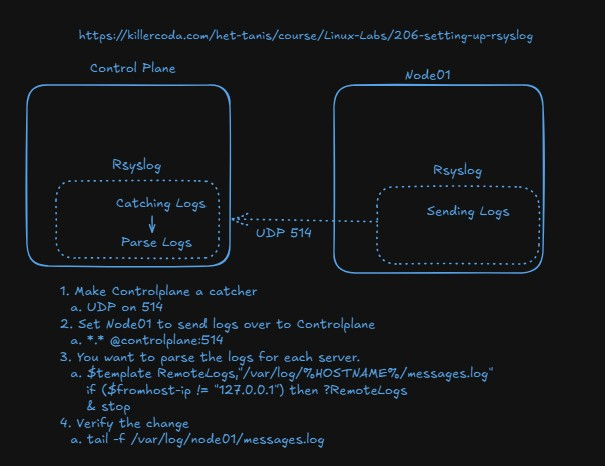
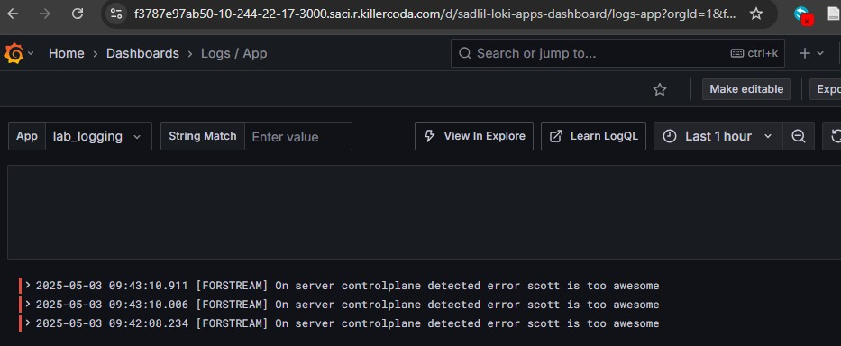
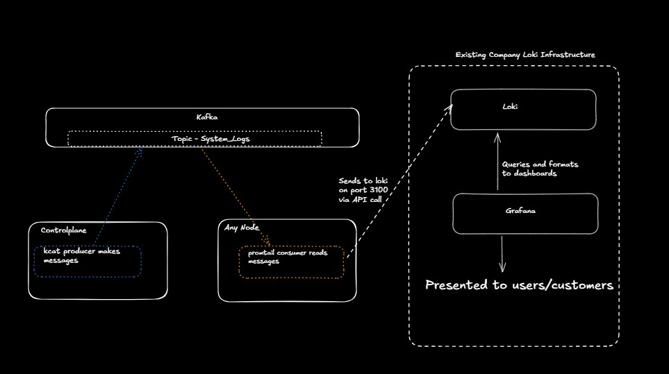

<div class="flex-container">
        </img>
    <p>
        <h1>Unit 6 Lab - Monitoring and Parsing Logs</h1>
    </p>
</div>

> If you are unable to finish the lab in the ProLUG lab environment we ask you `reboot`
> the machine from the command line so that other students will have the intended environment.

### Required Materials

Putty or other connection tool Lab Server

Root or sudo command access

STIG Viewer 2.18 (download from <https://public.cyber.mil/stigs/downloads/> )

#### Downloads

The lab has been provided below. The document(s) can be transposed to
the desired format so long as the content is preserved. For example, the `.txt`
could be transposed to a `.md` file.

- <a href="./assets/downloads/u6/u6_lab.txt" target="_blank" download>📥 u6_lab(`.txt`)</a>
- <a href="./assets/downloads/u6/u6_lab.pdf" target="_blank" download>📥 u6_lab(`.pdf`)</a>

## Lab 🧪

In keeping with the lab for this week, there are 4 major architectures for collecting and storing logs.
Within these architectures exist many mutations from the archetype that solve different problems addressed
in the scale, reliability, real-time analysis, budget, expertise, compliance, and existing infrastructure
of the systems being logged.

This lab will touch 3 of the 4 types of architectures, so that the learner
understands the deployment and capabilities. The 4th, cloud, architecture type will be optionally completed
by the learner for their cloud deployment of choice. The learner can then reflect on the tradeoff of why one
or another of these tools may be the right choice in their organization or not.

### Rsyslog forwarding and collection

1. Consider this architecture, where all modern Linux systems have built in rsyslog capabilities. One of them can
   be set to “catch” or aggregate all logs and then any number of servers can send over to them.

</img>

2. Complete the lab: <https://killercoda.com/het-tanis/course/Linux-Labs/206-setting-up-rsyslog>

   - Why do we split out the logs in this lab? Why don’t we just aggregated them to one place?

     - What do we split them out by?
     - How does that template configuration work?

   - Are we securing this communication in any way, or do we still need to configure that?

3. We will revisit this lab in Unit 10, with security involved via certificates, so make sure you are comfortable
   with the base components you are configuring.

### Agents forward to a centralized platform

1. Review the base architecture here: <https://grafana.com/docs/loki/latest/get-started/architecture/>

2. Complete the lab here: <https://killercoda.com/het-tanis/course/Linux-Labs/102-monitoring-linux-logs>

   - Does the lab work correctly, and do you understand the data flow?

   - While still in the lab

     - `cd /answers`

     - `python3 loki-write.py #Do this a few times`

     - Refresh your Grafana and change the app to lab_logging

     - Can you see it in your Grafana?

   </img>

   - Can you modify the file loki-write.py to say something related to your name?

   - Run this bash snippet and see if you can see your loki-writes

   ```bash
   curl -G -s "http://localhost:3100/loki/api/v1/query_range" \
   --data-urlencode 'query=sum(rate({job="lab_logging"}[10m])) by (level)' \
   --data-urlencode 'step=300' | jq
   ```

   - Can you modify that to see the actual entires? <https://grafana.com/docs/loki/latest/reference/loki-http-api/#query-logs-within-a-range-of-time>

3. We will revisit this lab in Unit 10, with security involved via certificates, so make sure you are
   comfortable with the base components you are configuring.

### Message Queues (Event Bus) for log aggregation and propagation

1. Apache Kafka is not the only message queue, but it is extremely popular (found in 80% for Fortune 100
   companies… or 80 of them). Read about the use cases here: <https://kafka.apache.org/uses>

2. Review our diagram here. Maybe we’re testing kafka and want to integrate it to the existing infrastructure.
   Maybe we have a remote location that we need to reliably catch logs in real time and then move them remote. There are many reasons to use this.

</img>

3. Complete the killercoda lab found here: <https://killercoda.com/het-tanis/course/Linux-Labs/108-kafka-to-loki-logging>

   - Did you get it all to work?

     - Does the flow make sense in the context of this diagram?

   - Can you find any configurations or blogs that describe why you might want to use this architecture or
     how it has been used in the industry?

### (OPTIONAL) Cloud-Native Logging services

1. OPTIONAL: Setup VPC flow logs in your AWS environment: <https://catalog.workshops.aws/well-architected-security/en-US/3-detection/40-vpc-flow-logs-analysis-dashboard/1-enable-vpc-flow-logs>

2. OPTIONAL: Even if not completing these labs, why might it be useful to understand the fields of a VPC flow log even if you’re not setting up logging in AWS environments (but your organization does use AWS)? https://docs.aws.amazon.com/vpc/latest/userguide/flow-logs-records-examples.html

## Digging Deeper challenge (not required for finishing lab)

1. For Architecture 3, using message queues. This is an excellent write-up of how disparate systems can be connected with a message queues or event bus to enhance metrics pipelining. <https://get.influxdata.com/rs/972-GDU-533/images/Customer%20Case%20Study_%20Wayfair.pdf>

   - They’re not necessarily doing logs, but rather metric data, but can you see how they solved their latency
     and connectivity problems on page 14 and 15?

2. Review some of the anti-patterns for cloud, but really any logging patterns. <https://docs.aws.amazon.com/wellarchitected/latest/framework/sec_detect_investigate_events_app_service_logging.html>

   - How do these relate to your current understanding of logging?

   - Do they show anything that you need to think about in the future of how you look at enterprise logging?

3. Go to <https://landscape.cncf.io/guide#observability-and-analysis--observability>

   - Which of these have you used and which have you not used?

   - How do many of these plug into existing observability patterns (logging)?

   - What is Fluentd trying to solve? How does it work? <https://www.fluentd.org/architecture>

> Be sure to `reboot` the lab machine from the command line when you are done.
