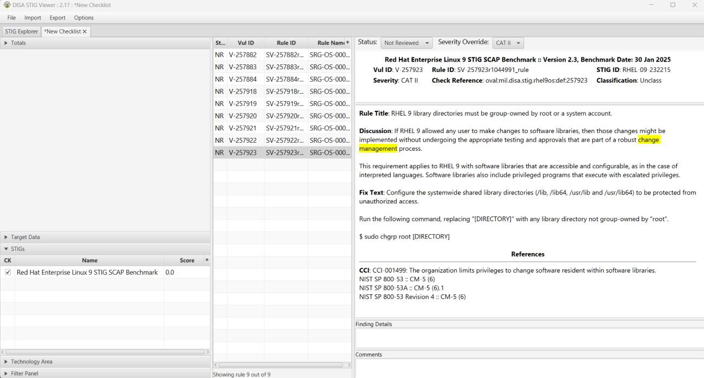
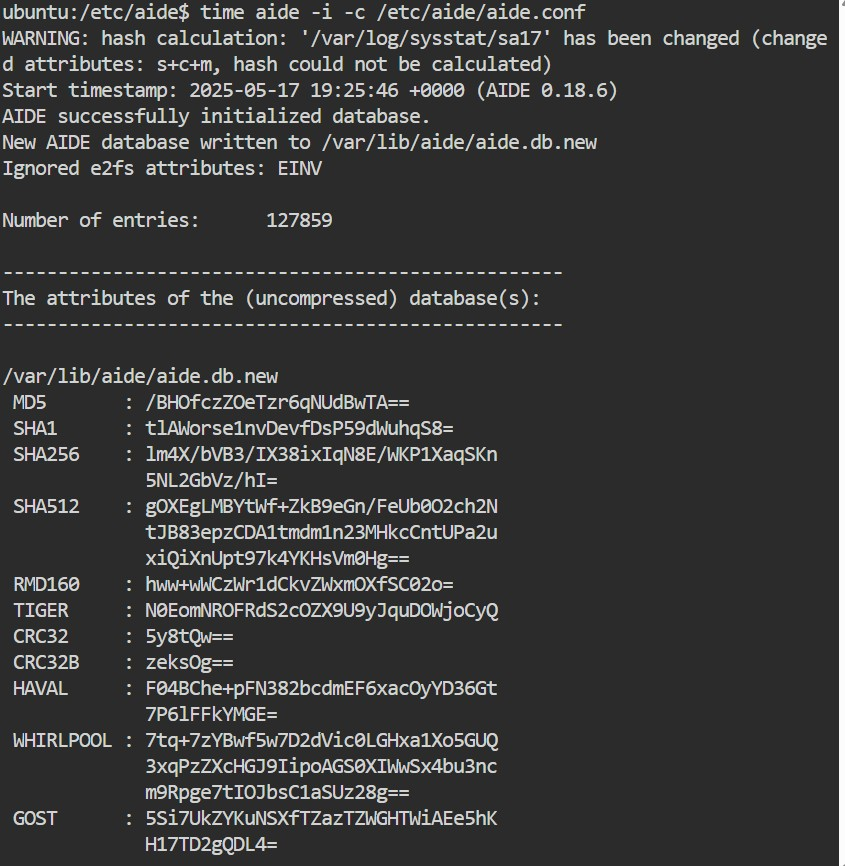
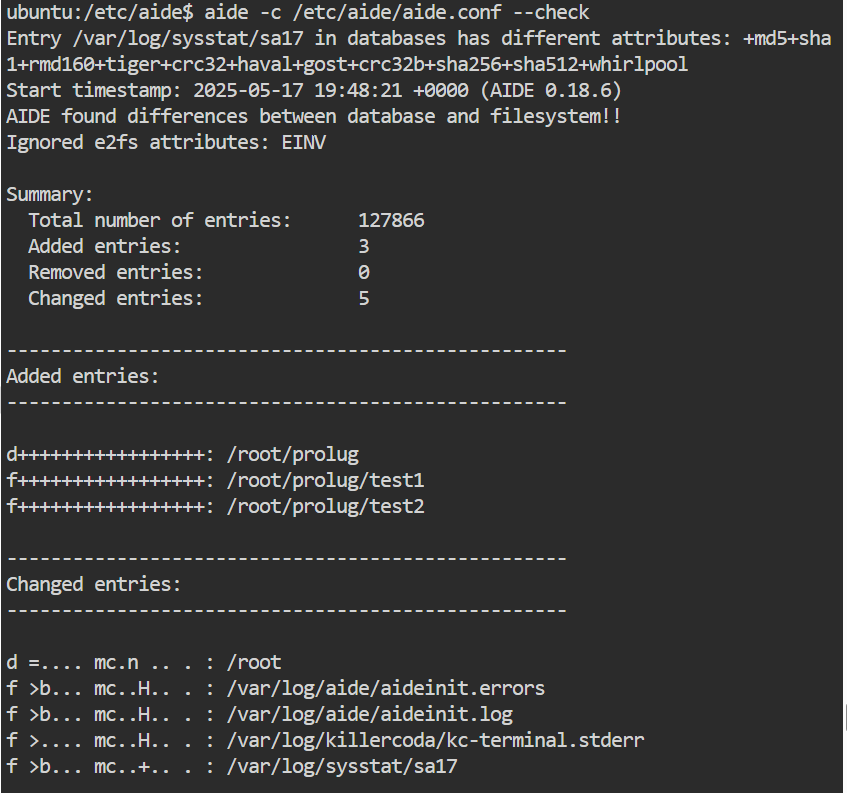
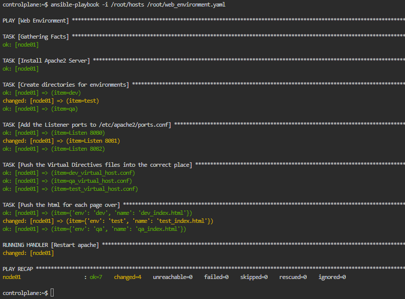

        </img>
    

        <h1>Configuration Drift and Remediation</h1>
    

> If you are unable to finish the lab in the ProLUG lab environment we ask you `reboot`
> the machine from the command line so that other students will have the intended environment.

### Required Materials

Putty or other connection tool Lab Server

Root or sudo command access

STIG Viewer 2.18 (download from <https://public.cyber.mil/stigs/downloads/> )

#### Downloads

The lab has been provided below. The document(s) can be transposed to
the desired format so long as the content is preserved. For example, the `.txt`
could be transposed to a `.md` file.

- <a href="./assets/downloads/u8/u8_lab.txt" target="_blank" download>📥 u8_lab(`.txt`)</a>
- <a href="./assets/downloads/u8/u8_lab.pdf" target="_blank" download>📥 u8_lab(`.pdf`)</a>

## Lab 🧪

These labs focus on configuration drift tracking and remediation.

### Operational Activities

1. Check your stig viewer and go to RHEL 9 stigs.

2. Set a filter for “change management”.

   - a. How many STIGs do you see?

3. Review the wording, what is meant by a robust change management process?
   - a. Do you think this can be applied in just one STIG? Why or why not?
   - b. What type of control is being implemented with change management in these STIGS?
   - i. Is it different across the STIGs or all the same?

### Monitoring configuration drift with Aide

1. Go into the sandbox lab: <https://killercoda.com/playgrounds/scenario/ubuntu>

2. Install aide and watch the installation happen.

   - a. `apt -y install aide`
   - b. What is being put in the path /etc/aide/aide.conf.d/ ?
     - i. How many files are in there?

3. Check your version of aide

   - a. `aide -v`

4. Read the man page (first page).

   - a. What does aide try to do, and how does it do it?

5. What is the configuration of cron found in /etc/cron.daily/dailyaidecheck?

   - a. What does this attempt to do?
   - b. What checks are there before execution?
   - c. Read the man for `capsh`, what is it used for?

6. Set up aide according to the default configuration

   - a. `time aide -i -c /etc/aide/aide.conf`
   - b. How long did that take?
     - i. How much time was wall clock v. system/user time?
     - ii. Why might you want to know this on your systems?
     - iii. What do you notice about the output?
       - 1. What do you need to go read about?

(Mine took 5 minutes 8 seconds to run on the lab system)

7. Set the database up properly

   - a. `cp /var/lib/aide/aide.db.new /var/lib/aide/aide.db`
   - b. `update-aide.conf`

8. Test aide by making files in a tracked directory

   - a. `mkdir /root/prolug`
   - b. `touch /root/prolug/test1`
   - c. `touch /root/prolug/test1`
   - d. `time aide -c /etc/aide/aide.conf –check`
     - i. Did you see your new files created?
     - ii. How long did this take to run?
       - 1. What type of usage do you see against user/system space?

### Using Ansible to fix drift

1. Complete the lab here: <https://killercoda.com/het-tanis/course/Ansible-Labs/16-Ansible-Web-Server-Env-Deploy>

2. When you finish ensure that you see broken output for 8081, as required.

   - a. `curl node01:8080`

3. One of the dev teams figured out they could modify the test and qa environments because a
   previous engineer left them in the sudoers file. You can address that separately with the security
   team, but for now you need to get those environments back to working. Run your original
   deployment command to see if it sets the environment back properly.

   - a. `ansible-playbook -i /root/hosts/root/web_environment.yaml`

- b. Did this force the system back into a working configuration?
  - i. If it worked, would it always work, or could they the system need to be
    manually intervened?
  - ii. What is your test? (hint: `curl` 8080 8081 and 8082 from previous commands)
- c. Could this cause potential problems in the environment?
  - i. If so, is that problem based on technology or operational practices? Why?

### Digging Deeper challenge (not required for finishing lab)

1. Complete this lab: <https://killercoda.com/het-tanis/course/Ansible-Labs/19-Ansible-csv-report>
   - a. Can you think about how you’d use this to verify that a system was stamped
     according to your build process?
     - i. You may have to tie it in with something like this lab and add some variables
       to your custom facts files, maybe the date of deployment:
       <https://killercoda.com/het-tanis/course/Ansible-Labs/12-Ansible-System-Facts-Grouping>

> Be sure to `reboot` the lab machine from the command line when you are done.
